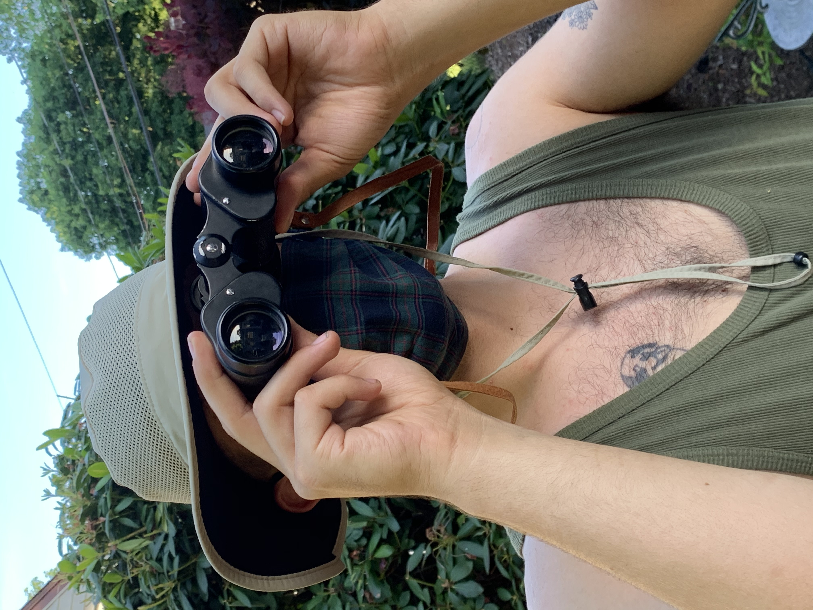

---

title: Bailey Sheehan
layout: default

---

# baileysheehan94

* fanfiction.net: [Dedue-luvrxDimitri](https://www.fanfiction.net/~dedueluvrxdimitri)
* switch friend code: SW-2540-7163-2149
* baileysheehan@protonmail.com

 

## Live
### what i'm currently working on (updated regularly)
* [MIT Video Application](live/mit.html)

## Websites
* [forever-mine](https://forever-mine.net/)
* [internalsquabbles](https://int-squab.net/)
* [symbolismforadvanced](http://symbolismforadvanced.com/)
* [thatbushisnotburning](http://thatbushisnotburning.net/)

## Fan Fiction
* last of us part 2 fan fiction
* cyberpunk 2077

Bailey Sheehan’s art practice focuses on developing new publications that inhabit a speculative voice and address what he has termed as “responsible digital dispersion.” Art criticism, and cultural commentary are foremost productive. They do not represent art, or culture so much as they participate in these processes and help constitute them— the contemporary writer must behave accordingly.

Bailey has produced several art outposts that focus on digital dispersion and a performative embodiment of speculative philosophy. His current principal influences are video games, The Happy Hypocrite, Alain Badiou, and Speculative Realism, Lamar Jackson, and [Rahul Shinde](https://rahulshinde.com/){:target="_blank"} (who built this site).

